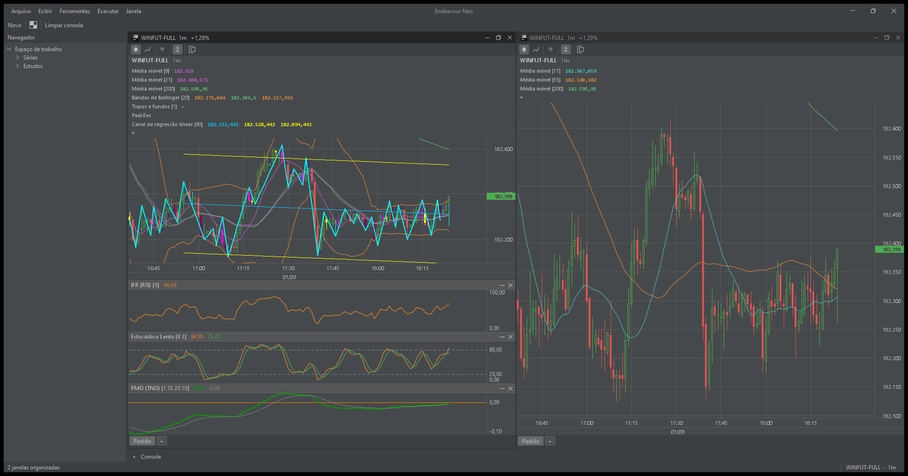
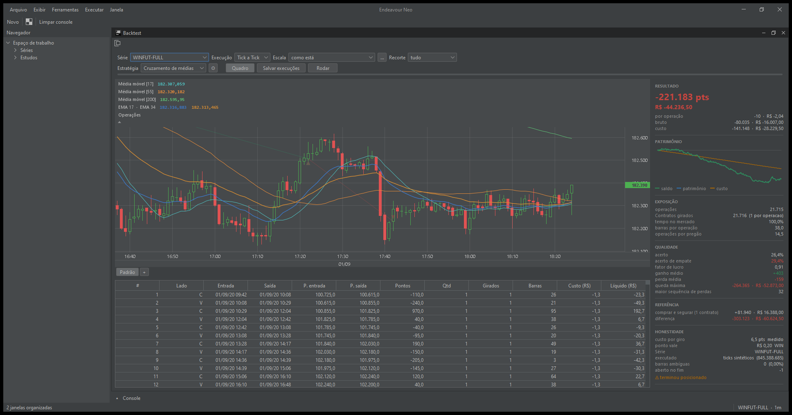
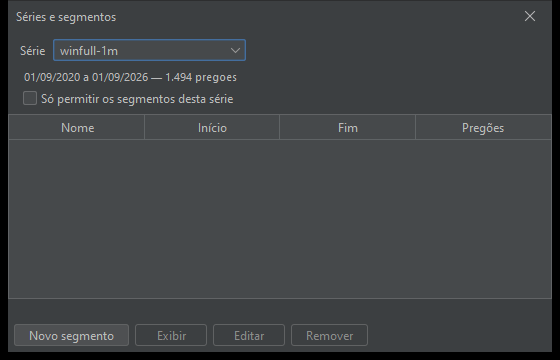

# Endeavour Neo

A charting and backtesting terminal for the Brazilian mini-index (WIN), written
in Java 17 and Swing, with no runtime dependency other than an optional look and
feel.

It exists to answer one question honestly: **did this rule ever make money, and
how would anybody know?** So the engine is built around the execution rules of
the platform the strategies actually run on — an order decided at a close never
executes at that close, a stop that gaps is a stop that did not fill, and a
cover order is one OCO of several legs where each leg can fill. Every number the
report shows is reachable from those rules, and the ones that rest on an
assumption say so.

## The chart



Two windows of the same series side by side — which is the point of a terminal
and not of an IDE: the same instrument at two zoom levels, compared. On the
left, seven indicators on the price (three moving averages, Bollinger bands,
tops and bottoms, candle patterns and a linear regression channel) and three
studies under it (RSI, slow stochastic, and the PMO ported from the author's own
Profit indicator).

Indicators are inserted from the chart's own menu, reordered by dragging, and the
arrangement is **remembered as a named layout** — so a chart reopens the way it
was left rather than as a blank price.

## The backtest



The whole measurement on one screen: the trades on the price, every operation in
a table, the equity curve, and the statistics beside them.

The strategy in this picture **loses 221.183 points**, and that is what the
picture is meant to show. A backtest screen that only ever illustrates a winner
teaches its reader nothing; this one is built so a losing result is as legible as
a winning one. Note the last block, **HONESTIDADE**: the cost actually charged
per round trip, how many bars were ambiguous — a bar where the stop and the
target were both reachable and the engine had to pick — whether the run ended
still holding a position, and how far the result sits from simply buying and
holding. Those are the numbers that decide whether the ones above them mean
anything.

Strategies available: moving-average crossing, range breakout, pattern breakout,
channel fade, the TNO momentum crossing, a two-range pattern setup, and the
IFR2. Each brings its own settings screen, so the toolbar never has to learn
what a period is.

## Series and segments



One stored series of one-minute bars is the source for everything, and a run's
scale is a fold of it. A series can be cut into named **segments** — a training
stretch, a blind stretch — and a series can be locked so that it only ever opens
as a segment. That lock is the defence against looking at test data without
noticing, which is the cheapest way to fool yourself and the hardest to detect
afterwards.

### Remaking these pictures

They are not taken by hand, so they can be remade when a screen changes instead
of quietly ageing into a lie about what the program looks like:

```
mvn -o test-compile
java "-Dendeavourneo.home=<a throwaway folder>" \
     -cp "target/classes;target/test-classes;<flatlaf jar>" \
     br.com.jorge.reis.endeavourneo.tools.Prints
```

Point `endeavourneo.home` somewhere disposable: opening and closing charts
replaces the remembered workspace, and a screenshot tool that rearranges the
windows of whoever runs it is not one anybody runs twice.

## Running

From an IDE: `br.com.jorge.reis.endeavourneo.Launcher`.
Pass `--light`, `--dark` or `--night` to pick a theme; the choice is remembered.

```
mvn compile
```

Market data is **not** in the repository. Put a series under `data/`, or point
the application at a folder of your own.

---

# The shell

Everything below is about the frame the terminal sits in, which was built first
and on purpose: an IDE-shaped window, in Swing, with no plugin framework.

```
+- Menu -----------------------------------------------+
+- Toolbar --------------------------------------------+
| Navigator |  Editors (tabs)                          |
|  (tree)   |                                          |
|           +------------------------------------------+
|           |  Console                                 |
+-----------+------------------------------------------+
| Status bar                                           |
+------------------------------------------------------+
```

## Why Swing and not Eclipse RCP

The goal was the **structure and the look** of an IDE, with no need for
third-party plugins. Every piece of that structure has a direct Swing
equivalent:

| Eclipse piece | here |
|---|---|
| Dockable views | `JSplitPane` |
| Editors | `JTabbedPane` |
| Navigator | `JTree` |
| Console | `JTextArea` with standard output redirected |
| Status line | `JPanel` + `JProgressBar` |
| Commands | `Action` + `KeyStroke` |
| Jobs | `SwingWorker` |
| Preferences | `JTree` + `CardLayout` dialog |
| Perspectives | `java.util.prefs.Preferences` |

What Eclipse RCP charges dearly for — OSGi, Tycho, a target platform,
`MANIFEST.MF`, `plugin.xml`, `.product` and a native SWT binary per platform —
is the price of **extensibility**, which is not in play here. Without
third-party plugins, RCP is a tax with nothing in return.

The proof that Swing gets there: IntelliJ IDEA, DataGrip and Android Studio are
written in Swing.

## What is not here

**Real docking.** You cannot drag the console to the right edge or tear it off
into its own window, and there are no named perspectives. That is the expensive
part of RCP and also the least used. Worth adding when its absence hurts —
there are Swing docking libraries — and not before.

What does exist is the useful half: **window size and divider positions are
stored**, so the application reopens the way you left it.

## Themes

Three, under `File > Preferences...`:

| theme | for |
|---|---|
| Light | a lit room |
| Dark | same high contrast, dark background; an aesthetic preference |
| **Night** | amber instead of blue, and *lower* contrast; an unlit room |

Night is not "dark, but darker". Colours move from blue towards amber because
blue light is what most disturbs sleep, and contrast drops because pure white on
pure black in the dark produces a halo that tires the eye over a long session.
High contrast is a virtue by day and a defect at 3am.

The palette lives in `src/main/resources/themes/FlatDarkLaf.properties`. FlatLaf
derives dozens of colours from half a dozen base ones, so edit the bases and
everything stays coherent.

## Look and feel

[FlatLaf](https://www.formdev.com/flatlaf/) is the look and feel derived from
IntelliJ. `Appearance` loads it **by reflection**: without the jar the
application still starts, using the system look and feel, instead of dying with
`NoClassDefFoundError`.

## Translations

Standard `ResourceBundle`, no dependency:

```
src/main/resources/messages.properties          English (base, must stay complete)
src/main/resources/messages_pt_BR.properties    Brazilian Portuguese
```

The JVM picks by `Locale.getDefault()`. Adding a language means adding one file;
keys missing from a translation fall back to English, so a half-finished
translation still works.

A missing key renders as `!key.name!` rather than an empty string — a blank
label looks like a layout bug and gets hunted for hours, while `!action.exit!`
says exactly what is wrong. `MainWindowTest` walks the menu bar looking for that
marker, so forgetting a key in the bundle fails the build.

Mnemonics live in the bundle too, under `<key>.mnemonic`, because the underlined
letter differs per language: *File* wants F, *Arquivo* wants A.

## Layout

```
Launcher.java      the composition root: wires the layers and starts the window
domain/market/     series, folds, sessions, segments
domain/indicator/  the arithmetic: averages, RSI, stochastic, PMO, pivots
domain/trading/    the engine: orders, broker, costs, trades, strategies
platform/          Appearance, Theme, Messages, JobService, SeriesCatalog
ui/shell/          MainWindow, Navigator, Console, StatusBar
ui/chart/          canvas, overlays, studies, layouts
ui/backtest/       the backtest screen and each strategy's own settings page
ui/replay/         bar-by-bar replay
ui/settings/       SettingsDialog, SettingsPage
```

**Dependencies point inward.** `domain` never imports `ui`, and `platform` never
imports `ui` — services must be usable with no screen at all, which is what lets
the same code run from a command-line tool. That rule is also why an indicator
the chart drew has to move into `domain/indicator` before a strategy can read
it: two implementations of one indicator drift, and the drift is invisible —
the chart says the market was oversold and the run says it was not, and both
pictures look right on their own.

`LayerBoundaryTest` fails the build if that stops being true, with no exemptions:
the one class that legitimately touches every layer is `Launcher`, and it sits at
the root rather than inside a layer for exactly that reason.

Adding a settings page means writing one `SettingsPage` and registering it in
`MainWindow.openPreferences`. The dialog itself never changes.

## Requirements

Java 17. Maven for the build. No runtime dependency other than FlatLaf, which is
optional.
