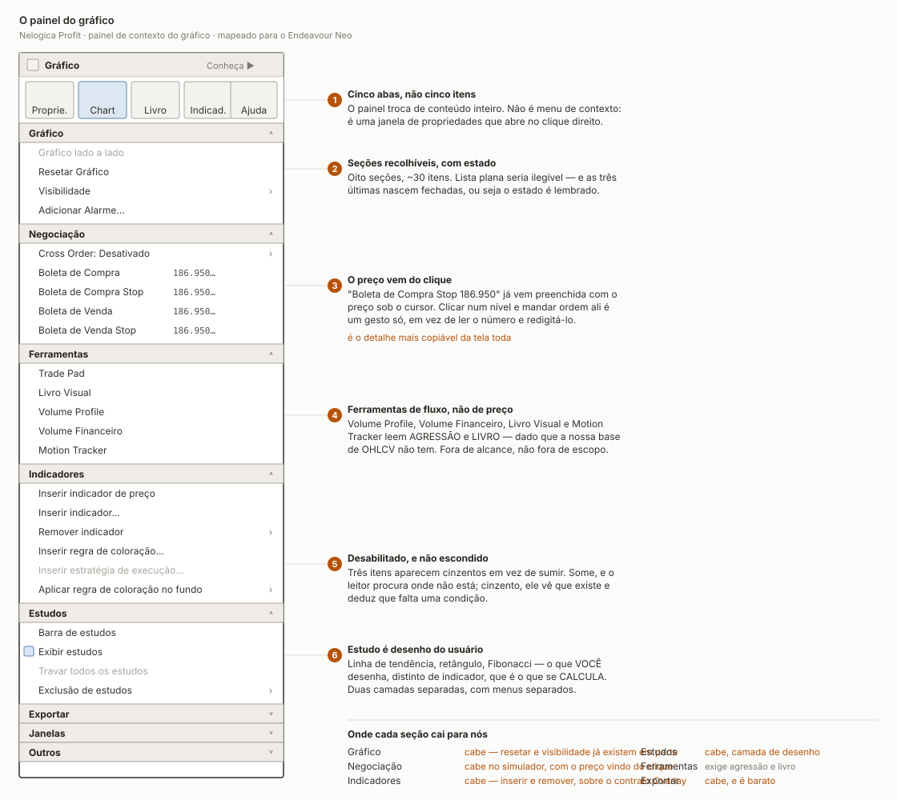

# Anatomy of the chart context menu

A map of the panel Profit opens on a right click over the chart, from a
screenshot taken 02/09/2026. Companion to [the window map](PROFIT-CHART-WINDOW.md).

Portuguese labels are kept verbatim: they are the artefact being described.

---

## It is not a context menu

Three things say so, and each is a design decision worth naming.

**Five tabs across the top** — *Proprie.*, *Chart*, *Livro*, *Indicad.*, *Ajuda*
— swap the whole panel. A menu does not have tabs. This is a properties window
that happens to open on right click.

**Eight collapsible sections** holding around thirty items. A flat list of thirty
would be unreadable, and the three last sections open collapsed, which means the
open/closed state is remembered between uses.

**Disabled items stay visible** rather than disappearing: *Gráfico lado a lado*,
*Inserir estratégia de execução…*, *Travar todos os estudos*. Hiding them would
send the reader looking where the item is not; greying them says it exists and
some condition is missing.

---

## Gráfico

| item | what it does | status |
|---|---|---|
| Gráfico lado a lado | side-by-side comparison; **disabled here** | no |
| Resetar Gráfico | back to the default zoom and scale | partly — we reset the vertical scale |
| Visibilidade ▸ | what is drawn: grid, crosshair, last price | maybe |
| Adicionar Alarme… | price alert | no — needs a live feed |

## Negociação

| item | what it does | status |
|---|---|---|
| Cross Order ▸ | prevents self-crossing on the exchange | no |
| Boleta de Compra `186.950…` | buy ticket, **pre-filled with the clicked price** | simulator |
| Boleta de Compra Stop `186.950…` | buy stop at that price | simulator |
| Boleta de Venda `186.950…` | sell ticket | simulator |
| Boleta de Venda Stop `186.950…` | sell stop | simulator |

> **The price comes from the click, and that is the most copyable detail on the
> screen.** Right-clicking at a level and choosing *Boleta de Compra Stop* fills
> the ticket with that level. One gesture instead of reading the number off the
> axis and typing it back in — and typing it back in is where the digit gets
> dropped.

## Ferramentas

| item | reads | status |
|---|---|---|
| Trade Pad | order entry surface | simulator, later |
| Livro Visual | the order book | **out of reach** |
| Volume Profile | traded volume by price | out of reach |
| Volume Financeiro | financial volume | partly — we have `<VOL>` |
| Motion Tracker | aggression flow | out of reach |

> Out of reach rather than out of scope. These read the **book** and the
> **aggressor side**, and an OHLCV series does not contain either. Wanting them
> is not the constraint; having the data is.

## Indicadores

| item | what it does | status |
|---|---|---|
| Inserir indicador de preço | one drawn on the price scale | **building now** |
| Inserir indicador… | the full catalogue | **building now** |
| Remover indicador ▸ | lists what is applied | **building now** |
| Inserir regra de coloração… | conditional bar colouring | maybe |
| Inserir estratégia de execução… | attach an automated strategy; **disabled** | no |
| Aplicar regra de coloração no fundo ▸ | conditional background | maybe |

**Profit separates "indicador de preço" from "indicador".** The first goes on the
price axis, the second into a panel of its own below. It is the same split as
`Overlay` versus a study panel, arrived at independently — which is a good sign
the cut is real and not an accident of one product.

## Estudos

| item | what it does | status |
|---|---|---|
| Barra de estudos | the drawing toolbar | planned |
| Exibir estudos | show or hide them all; **ticked** | planned |
| Travar todos os estudos | lock against accidental edits; **disabled** | planned |
| Exclusão de estudos ▸ | delete by kind | planned |

> **A *study* is what you draw; an *indicator* is what is calculated.** Trend
> lines, rectangles, Fibonacci — placed by hand, anchored to bars, saved with the
> chart. Two separate layers, with separate menus, and Profit keeps them apart
> throughout. Merging them would mean one list mixing "EMA 200" with "that line I
> drew on Tuesday".

## Exportar · Janelas · Outros

Collapsed in the screenshot, so their contents are unknown. Exporting the visible
bars to CSV is cheap and worth having early — it is how a chart stops being a
dead end when someone wants the numbers in a spreadsheet.

---

## What we are building now

Only the **Indicadores** section, and only its first three items: insert and
remove. They sit on the `Overlay` contract that already exists, so the work is
the menu, a catalogue and a parameters dialog — not new drawing.

The rest waits: *Negociação* for the simulator, *Estudos* for a drawing layer,
*Ferramentas* for data we do not have.
